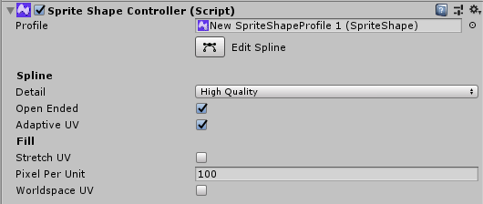
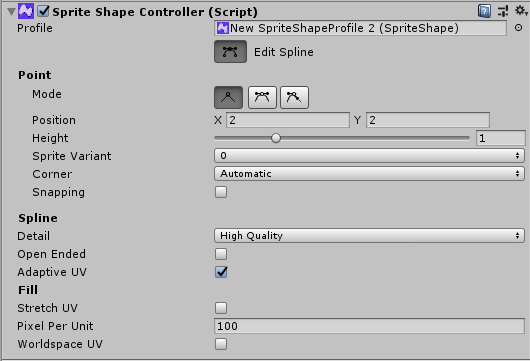
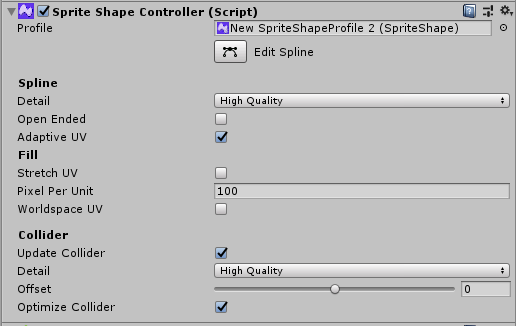
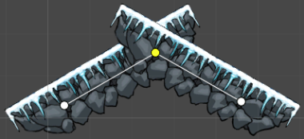

# Sprite Shape Controller

The **Sprite Shape Controller** component is automatically attached to the GameObject created when a **Sprite Shape Profile** is dragged into the Scene. You edit the shape of the Sprite Shape's outline through the Controller's settings. The Controller displays different settings depending on different conditions.

## Property Settings - Default

The default component settings below are displayed when no Control Point is currently selected.

| **Property**                                                 | **Function**                                                 |
| ------------------------------------------------------------ | ------------------------------------------------------------ |
| **Profile**                                                  | Select the **Sprite Shape Profile** used by this Sprite Shape. |
| **Edit Spline**                                              | Enable  to make the Control Points of the Sprite Shape visible and editable. |
| **Spline**                                                   | -                                                            |
| **Detail**                                                   | Select the tessellation quality of the rendered Sprite Shape mesh. High/Medium/Low Quality options available. |
| **Open Ended**                                               | Disable to connect both ends of the Sprite Shape together to form an enclosed Shape. Enable to leave both ends of the Sprite Shape unconnected. |
| **Adaptive UV**                                              | Enabled by default. When enabled, Unity attempts to seamlessly tile the Sprites along the Sprite Shape path by deforming the Sprites to between Control Points. Disable this property to tile Sprites with no deformation and at  their exact width. Sprites may appear cutoff if the space between Control Points is shorter than the width of the Sprite. |
| **Fill**                                                     | -                                                            |
| **Stretch UV**                                               | Enable this setting to have Unity stretch the UV of the Fill texture across the Full Rect of the Sprite Shape. |
| **Pixels Per Unit** (only available when Stretch UV is disabled) | This values affect the appearance of the Fill texture of the Sprite Shape. This value affects the scale of the Fill texture, with higher values reducing the size of the texture. The default value is 100. |
| **World Space UV** (only available when **Stretch UV** is disabled)** | Enable to apply the Fill texture according to the World Space UV, instead of per GameObject UV. |

### With a Control Point selected

Enable **Edit Spline** in the Controller settings to make Control Points on the Sprite Shape visible and editable. Selecting a Control Point enables the following additional Controller settings.

| **Point**                                               | -                                                            |
| ------------------------------------------------------- | ------------------------------------------------------------ |
| **Mode**                                                | Select one of three **Point Modes** to change the way tangents on Control Points are edited. |
| **Linear**              | No curve is formed between the Control Point and its neighboring points. |
| **Continuous Mirrored** | Two tangents appear on opposite sides of the Control Point, and the spline between the Control Point and its neighbors becomes curved. Adjust the tangents to change the shape of the curve. The angle between the two tangents is always 180 degrees in this mode. |
| **Broken Mirrored**     | Two tangents appear on opposite sides of the Control Point, and the spline between the Control Point and its neighbors becomes curved. Adjust the tangents to change the shape of the curve. The length and angle of the tangents can be adjusted independently in this mood. |
| **Position**                                            | The local x and y coordinates of a selected Control Point.   |
| **Sprite Variant**                                      | Select the **Sprite Variant** to render from number choices in the drop-down menu. Press **N** to cycle through all available Variants at that Control Point. |
| **Corner**                                              | Sets whether Corner Sprites are rendered at Control Points. Set to **Automatic** by default. |
| **Automatic**                                           | The Control Point displays the assigned Corner Sprite, if both it and its neighbors are in **Linear Point Mode**. |
| **Disabled**                                            | The selected Control Point does not automatically render a Control Point. |
| **Snapping**                                            | Enable to snap Control Points according the Project's Snap settings. |

### Additional Collider settings

Add either the **Polygon Collider 2D** or **Edge Collider 2D** component to the **Sprite Shape** to enable additional **Collider** settings in the **Sprite Shape Controller**. See the [Enabling Collision](SSCollision.md) page for more details about enabling Colliders with Sprite Shapes.

| Collider              | -                                                            |
| --------------------- | ------------------------------------------------------------ |
| **Update Collider**   | Enabled by Default. Enable this option to have the Collider mesh be updated to the Sprite Shape's current shape as the Sprite Shape is edited. Disable if you are editing the Collider mesh separately from the Sprite Shape and to use a custom Collider mesh. |
| **Detail**            | Sets the tessellation quality of the rendered Collider. High/Medium/Low Quality options available. |
| **Offset**            | Select the amount to extrude the Collider mesh towards the edge of the Sprite Shape. The range is from -0.5 to 0.5, starting at 0 by default. |
| **Optimize Collider** | Enabled by default. Enable to have Unity optimize the Collider mesh by cleaning up extra control points that are co-linear. Disable this option when editing the Collider mesh separately from the Sprite Shape to prevent Unity from affecting the custom Collider mesh. |

## Editing the Spline

To edit the mesh outline of the **Sprite Shape**, click the **Edit Spline** button to make the Shape's spline and its **Control Points** become visible and editable.

When **Edit Spline** is enabled, move the Control Points of the Sprite Shape to adjust its overall shape and size. Add additional Control Points by clicking on the spline in between Control Points. Press the **Del/Delete** key to remove the currently selected Control Point.

With a Control Point selected, cycle through the **Point Modes **by pressing the **M** key. To change the **Mode** of multiple Control Points at once, ensure that all selected Control Points are the same **Mode** first before cycling or selecting another **Mode**.

To change the Sprite Variant currently displayed at a selected Control Point, press the **N** key to cycle through all available Variants.

All shortcut keys can be rebound under the Shortcut menu (menu: **Edit > Shortcuts... > SpriteShape Editing**).

## Point Modes

When a Control Point is selected, its **Point Mode** can be one of three modes- **Linear**, **Mirrored**, and **Non-Mirrored**.

The **Point Mode** determines the behavior of the tangents that are used to adjust the spline between Control Points. Each Control Point can be set to a specific Point Mode and contain its own settings. 

### Linear Point Mode

In **Linear Point Mode**, there are no tangents to control the curve between the Control Point and its neighbors, curves are not formed between Control Points and Sprites may overlap if they intersect. 

Adjust which Sprite is displayed when two or more intersect by adjusting their **Order** value in the [Sprite Shape Profile's](SSProfile.md) **Angle Range** settings.

### Continuous Mirrored Point Mode

In **Continuous Mirrored Point Mode**, tangents appear on both sides of the selected Control Point to create a curve between the Control Point and its neighbors. Adjust the shape of the curve with the tangents. In this mode, the angle between the tangents is always maintained at 180 degrees although their lengths from the can vary. 

Press **B** to mirror the length of the last edited tangent onto the opposite tangent.

### Broken Mirrored Point Mode

In **Broken Mirrored Point Mode**,  tangents appear on both sides of the selected Control Point to create a curve between the Control Point and its neighbors. Adjust the shape of the curve with the tangents. In this mode, the length and angle of each tangent can be adjusted independently. 

Press **B** to mirror the length of the last edited tangent onto the opposite tangent. In this mode, pressing **B** also causes the angle of the opposite tangent to become exactly 180 degrees from the last edited tangent.

